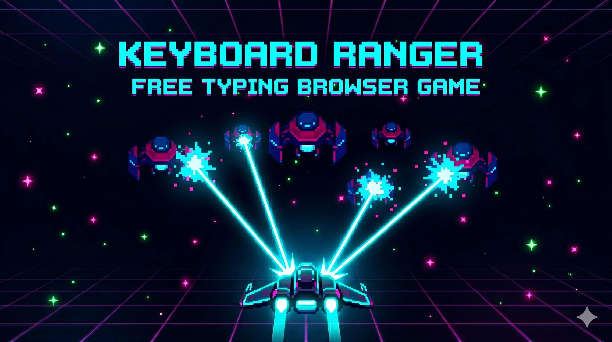

# Keyboard Ranger ⌨️🚀

A free sci-fi typing defense game. Defend the galaxy by typing words to destroy alien invaders!



## Play Online

**Live Game**: https://keyspacer.pages.dev/

## How to Play

1. **Type the words** shown on incoming invaders
2. **Type fast and accurately** - wrong letters make enemies shoot back
3. **Collect powerups**:
   - 🛡️ Shield - Click promo link for 2x health
   - ⚡ Thunder - Kill thunder enemies to charge ultimate
4. **Climb the leaderboard** - Submit your score!

## Features

- 🎮 Wave-based difficulty scaling (1-99)
- ⚡ Chain lightning ultimate ability
- 🏆 Global leaderboard
- 🔊 Sound effects & background music
- 📱 Works on desktop (best) and mobile

## Embedding

See [EMBED.md](EMBED.md) for website embedding options.

### Quick Iframe Embed
```html
<iframe src="https://keyspacer.pages.dev/" 
        width="100%" 
        height="640" 
        frameborder="0"
        allow="fullscreen"></iframe>
```

## Development

### Files

- `index.html` - Main game
- `code.gs` - Google Apps Script for leaderboard API
- `words.txt` - Word list (add more words here)
- `EMBED.md` - Embedding guide

### Local Testing

Open `index.html` in a browser. The game loads words from `words.txt` - make sure both files are in the same folder.

### Deploy

1. Push to GitHub
2. Enable GitHub Pages in Settings
3. Game available at `https://yourusername.github.io/repo/`

## Tech Stack

- Pure HTML5 Canvas (no frameworks)
- JavaScript (vanilla)
- Google Apps Script (leaderboard backend)

## License

MIT License - Feel free to use and modify!

---

**Keyboard Ranger** - Defend the galaxy, one word at a time. 🚀